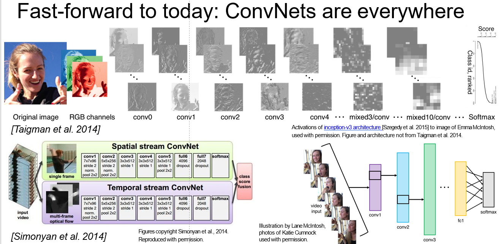

# 5.1 卷积神经网络历史 History of Convolutional Neural Networks

##  5.1.1 回顾 Review

简单回顾一下上节课的内容，我们讲了神经网络，看了头几堂课上说的线性评分函数的运行实例。然后通过向上堆叠这些线性层，并在层间添加非线性来实现完整的神经网络。我们还发现这有助于解决模式问题，我们通过学习任务所需的中间模板，例如不同类型的车辆。把中间特征组合起来得到某一类别的最终的评分函数。

A quick review of last time, we talked about neural networks, and how we had the running example of the linear score function that we talked about through the first few lectures. And then we turned this into a neural network by stacking these linear layers on top of each other with non-linearities in between. And we also saw that this could help address the mode problem where we are able to learn intermediate templates that are looking for, for example,  different types of cars. And to combine these together to come up with the final score function for a class.

我们今天要讨论的是卷积神经网络，它与常规神经网络的构想基本一致，不同的是需要训练卷积层，因为卷积层更能保留输入的空间结构。

Today we're going to talk about convolutional neural networks, which is basically the same sort of idea, but now we're going to learn convolutional layers that reason on top of basically explicitly trying to maintain spatial structure.

## 5.1.2 历史 History

我们先来讲一下神经网络的历史，了解一下卷积网络的诞生，向上一直追溯到 1957 年，Frank Rosenblatt 发明了第一代感知机器，首次实现了所谓的感知器算法，它在思想上跟得到评分函数的过程类似，比如说 $Wx+b$。不过感知机的输出只有 0 和 1。然后设立更新规则，权重 $W$ 的更新规则，看起来也像是反向传播算法的规则，但此时反向传播尚未发明，这里仅仅把权重向着我们所希望的某个方向去调整。在 1960 年，Widrow 和 Hoff 发明了 Adaline 和 Madaline，首次尝试把线性层叠加，整合为多层感知器网络。现在好像与神经网络的层的设计比较接近了，不过反向传播或其他的训练方法仍未出现。1986 年 Rumelhart 才首次提出了反向传播算法。从这里开始，链式法则、更新规则，方程这些我们熟悉的东西次第产生，我们第一次有了一种最核心的训练方法来让这些网络工作。不过在很长一段时间内，我们仍然无法训练超大型神经网络，所以神经网络领域曾经常年无人问津，更不用说大规模应用了。2000 年左右，事情开始有了变化，在 2006 年，Geoff. Hinton 与 Ruslan Salakhutdinov 合作的一篇论文，表明深度神经网络不仅可以训练，并且可以高效地训练。但这仍不是神经网络现在的样子。彼时的网络需要谨慎的初始化才能进行反向传播，他们的方法就是先经过一个预训练阶段，对每一个隐含层使用受限玻尔兹曼机来建模，这样通过迭代训练每一层，可以得到一些初始化权重。得到所有的隐层之后，以此来初始化整个神经网络，然后反向传播，微调参数。这样，实际上直到 2012 年，神经网络才第一次取得了惊人的成果，深度神经网络的狂潮由此爆发。第一个被攻破的领域是语音识别，Hinton 组利用深度神经网络，进行声学建模和语音识别。然后是图像识别，2012 年 Hinton 同一个实验室的 Alex Krizhevsky 发表了里程碑式的论文，首次让卷积神经网络的框架在 ImageNet 分类大赛中取得了惊人的成绩。CNN 树立了 ImageNet 图像分类任务的标杆，并且大幅降低了误差。此后，卷积网络才逐渐得到了广泛应用。

Let's first talk about the history of neural networks, and then also how convolutional neural networks were developed. We can go all the way back to 1957 with Frank Rosenblatt, who developed the Mark I Perceptron machine, which was the first implementation of an algorithm called the perceptron, which had sort of the similar idea of getting score functions, using some $Wx+b$. But here the outputs are going to be either 1 or 0. And then in this case we have an update rule, an update rule for our weights, $W$, which also look kind of similar to the type of update rule that we're also seeing in backprop, but in this case there was no principled backpropagation technique yet, we just sort of took the weights and adjusted them in the direction towards the target that we wanted. In 1960, we had Widrow and Hoff who developed Adaline and Madaline, which was the first time that we were able to start to stack these linear layers into multilayer perceptron networks. And this is starting to now look kind of like this idea of neural network layers, but we still didn't have backprop or any sort of principled way to train this. And so the first time backprop was really introduced was in 1986 with Rumelhart. And so here we can start seeing these kinds of equations with the chain rule and the update rules that we're starting to get familiar with, so this is the first time we started to have a principled way to train these kinds of network architectures. After that, it still wasn't able to scale to very large neural networks, and so there was sort of a period in which there wasn't a whole lot of things happening here, or a lot of popular use of these kinds of networks. It's really started being reinvigorated around the 2000s, so in 2006, there was this paper by Geoff. Hinton and Ruslan Salakhutdinov, which basically showed that we could train a deep neural network, and show that we could do this effectively. But it's not quite the sort of modern iteration of neural networks. It required really careful initialization in order to be able to do backprop, so what they had here was they would have this first pre-training stage, where you model each hidden layer through this kind of through a restricted Boltzmann machine, and so you're going to get some initialized weights by training each of these layers iteratively. And so once you get all of these hidden layers, you then use that to initialize your full neural network, and then from there you do backprop and fine tuning of that. And when we really started to get the first really strong results using neural networks, and what sort of really sparked the whole craze of starting to use these kinds of networks really widely was at around 2012, where we had first the strongest results using for speech recognition, and so this work out of Hinton's lad for acoustic modeling and speech recognition. And then for image recognition, 2012 was the landmark paper from Alex Krizhevsky in Hinton's lad, which introduced the first convolutional neural network architecture that was able to get really strong results on ImageNet classification. And so it took the ImageNet, image classification benchmark, and was able to dramatically reduce the error on that benchmark. And so since then, ConvNets have gotten really widely used in all kinds of applications.

现在我们回过头来看看卷积网络的产生过程。 还是回到 50 年代，Hubel 和 Wiesel 做了一系列实验，尝试弄清神经元在视觉皮层的工作原理，他们把猫作为实验对象。在课程第一节我们提到过这个实验，大体来说，他们把电极放进猫的脑袋里，然后给猫不同的视觉刺激，不同的边缘，有方向的边缘，不同的形状之类的，然后来测度神经元的应激响应。实验得出了一些当时技术水平观察之后的重要结论。第一件是皮层上的一部分褶皱映射。皮层附近的细胞与视觉的周边区域相关联。可以看到，在右侧的图上，经过一种空间映射可以把它映射到视觉皮层更多的周边区域，就是这些蓝色区域，远离中心点的蓝色区域。他们还发现这些神经元之间存在层级关系。不同类型的视觉刺激，会在初级皮层上引起视网膜神经节细胞的不同相应，看上去就像这种以点为中心的圆形区域。上面还有一些简单细胞，会对有向边缘和不同朝向的光刺激产生影响。更进一步的，他们发现简单细胞连接着更复杂的细胞，复杂细胞对光的朝向和移动产生反应。这样越来越复杂往后就到了所谓超复杂细胞，能响应端点的移动。现在皮层认出了边角认出了形状。

So now let's step back and take a look at what gave rise to convolutional neural networks specifically. And so we can go back to the 1950s, where Hubel and Wiesel did a series of experiments trying to understand how neurons in the visual cortex worked, and they studied this specifically for cats. And we talked about this in lecture one, but basically in these experiments they put electrodes into the cat brain and  they gave the cat different visual stimulus, different kind of edges, oriented edges, different sorts of shapes, and they measured the response of the neurons to these stimuli. And there were a couple of important conclusions that they were able to make, and observations. And the first thing found that there's sort of this topographical mapping in the cortex. So nearby cells in the cortex also represent nearby regions in the visual field. And you can see, on the right here where if you take kind of the spatial mapping and map this onto a visual cortex there's more peripheral regions are these blue areas, farther away from the center. And they also discover that these neurons had a hierarchical organization. If you look at different types of visual stimuli they were able to find that at the earliest layers retinal ganglion cells were responsive to things that looked kind of like circular regions of spots. And on top of that there are simple cells, and the simple cells are responsive to oriented edges, so different orientation of the light stimulus. And then going further, they discover that these were then connected to more complex cells, which were responsive to both light orientation as well as movement, and so on. And get increasing complexity, for example, hyper-complex cells are now responsive to movement with kind of an endpoint. And so now you're starting to get the idea of corners and then blobs and so on.

到了 1980 年，被称为神经认知机的一种网络框架模型，首次把 Hubel 和 Wiesel 发现的简单和复杂细胞概念形成实例。福岛邦彦将其诠释为简单细胞和复杂细胞的交替层结构，简单细胞中存在可调参数，复杂细胞在简单细胞之上采用一种采样（汇合）操作，也就是相对固定的，是对简单单元的微小修改。

Then in 1980, the neocognitron was the first example of a network architecture, a model, that had this idea of simple and complex cells that Hubel and Wiesel had discovered. And in this case Fukushima put these into these alternating layers of simple and complex cells, where you had these simple cells that had modifiable parameters, and then complex cells on top of these that performed a sort of pooling so that is was invariant to,  different minor modifications from the simple cells.

这就是上世纪八十年代的工作，到了 1998 年 Yann LeCun 首次展示了第一个利用反向传播和基于梯度学习方法来训练卷积神经网络的实例，这对文档识别非常有效，尤其是对邮政编码的识别效果极好。因此这些方法在邮政服务中被广泛应用于邮政编码识别。然而它不能扩展到更具有挑战，更复杂的数据，数字非常容易识别，而且识别范围有限。

And this is work that was in the 1980s, and by 1998 Yann LeCun showed the first example of applying backpropagation and gradient-based learning to train convolutional neural networks that did really well on document recognition, specifically they were able to do a good job of recognizing digits of zip codes. So these were then used pretty widely for zip code recognition in the postal service. But beyond that it wasn't able to scale yet to more challenging and complex data, digits are still fairly simple and a limited set to recognize.

在 2012 年，Alex Krizhevsky 提出了一种个现代化的卷积神经网络，我们一般称之为 AlexNet。但 AlexNet 和 Yann LeCun 提出的卷积神经网络相比，看上去并没有多大差异。它们只是扩展得更大更深，最重要的一点是它们可以充分利用大量可以得到的网络图像数据，ImageNet 数据集之类的。同时也充分发挥了 GPU 并行计算能力的优势。

And this is where Alex Krizhevsky, in 2012, give a model incarnation of convolutional neural networks, and his network we sort of colloquially call AlexNet. But this network really didn't look so much different than the convolutional neural networks that Yann LeCun was dealing with. They were scaled now to be larger and deeper, and the most important parts were that they were now able to take advantage of the large amount of data that's now available, in web images, in ImageNet data set. As well as take advantage of the parallel computing power in GPUs.

## 5.1.3 应用 Application

<table>
    <tr>
        <td >

</td>
        <td >

</td>
        <td >

</td>
    </tr>
    <tr>
        <td >

</td>
        <td >

</td>
        <td >

</td>
    </tr>
    <tr>
        <td >

</td>
        <td >

</td>
        <td >

</td>
    </tr>
</table>

---------------------
今天大家都知道 ConvNets 被广泛应用，根据 AlexNet，我们可以得到 ImageNet 的初始分类结果。这对图像检索的效果起到了很好的促进作用。可以看到，如果想检索花的图片，它的特征将被学习，然后进行一个非常有效的相似度匹配。我们也可以将 ConvNets 用于检测，那样我们可以很好地定位图像中的汽车、船等物体。然后在物体周围绘制精确的边框。我们甚至可以进一步实现分割，这些是更丰富的任务，不需要绘制边界框，而是去标记诸如树、人等物体的轮廓像素。这些算法被应用于自动驾驶汽车等领域，它们大多由 GPU 驱动，正如我们之前所提，可以实现并行处理，以及有效训练和运行这些 ConvNets。如今我们有了非常先进且强有力的 GPU，它们工作在嵌入式系统中，例如自动驾驶汽车。

But fast forwarding today, so now, ConvNets are used everywhere. And we have the initial classification results on ImageNet from AlexNet. This is able to do a really good job of image retrieval. You can see that when we're trying to retrieve a flower for example, the features that are learned are really powerful for doing similarity matching. We also have ConvNets that are used for detection. So we're able to do a really good job of localizing where in an image is, for example, a bus, or a boat, and so on, and draw precise bounding boxes around that. We're able to go even deeper beyond that to do segmentation, and so these are now richer tasks where we're not looking for just the bounding box but we're actually going to label every pixel in the outline of trees and people and so on. And these kind of algorithms are used in self-driving cars and a lot of this is powered by GPUs as I mentioned earlier, that's able to do parallel processing and able to efficiently train and run these ConvNets.  And so we have modern powerful GPUs as well as ones that work in embedded system, for example, that you would use in a self-driving car.

我们来看看 ConvNets 其他的一些应用。人脸识别中，我们将人脸图像作为输入，求出这是谁的脸。ConvNets 也可以用于视频，这是一个视频网络的例子包含了每一帧图像及当时的信息，从而可以分类视频。我们也可以进行姿势识别，识别肩部、肘部、和不同关节。它们也可应用于游戏中，你可以看见一些增强学习任务，更深层的增强学习任务，Playing Atari 和 AlphaGo 等。其中 ConvNets 是重要的部分。用于医学图像的解释和诊断，星系分类，路标识别，鲸识别，航测图识别。

So we can also look at some of the other applications that ConvNets are used for. Face-recognition, we can put an input image of face and get out a likelihood of who this person is. ConvNets are applied to video, and so this is an example of a video network that looks at both images as well as temporal information, and from there is able to classify videos. We're also able to do pose recognition, to recognize shoulders, elbows, and different joints. They are also used in game playing. So some of the work in reinforcement learning, deeper enforcement learning that you may have seen, Playing Atari games and AlphaGo and so on. And ConvNets are an important part of all of these. They are being used for interpretation and diagnosis of medical image, for classification of galaxies, for street sign recognition, whale recognition, aerial maps.

除了分类检测识别这类任务，还有一些图像描述的任务，给定一张图片，我们想要一句话描述图像里有什么，这是我们课程后面会涉及的东西。我们还可以用神经网络完成一些很棒的艺术作品。有一个风格迁移的工作，我们拍摄照片然后采用某位艺术家的某件作品的风格对它进行重新渲染，

And beyond recognition of classification detection, these types of tasks, we also have tasks like image captioning, where given an image, we want to write a sentence description about what's in the image, and this is something that we'll go into a little bit later in the class. And we also have  really fancy and cool kind of artwork that we can do using neural networks. There is neural style type work, where we take an image and we're able to re-render this image using a style of a particular artist and artwork.

