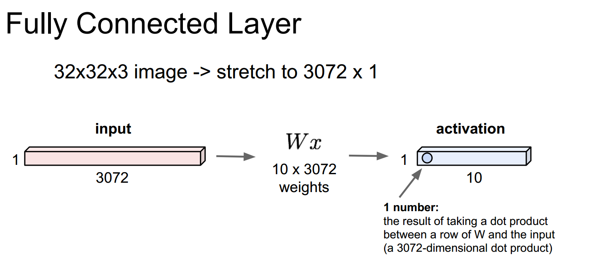
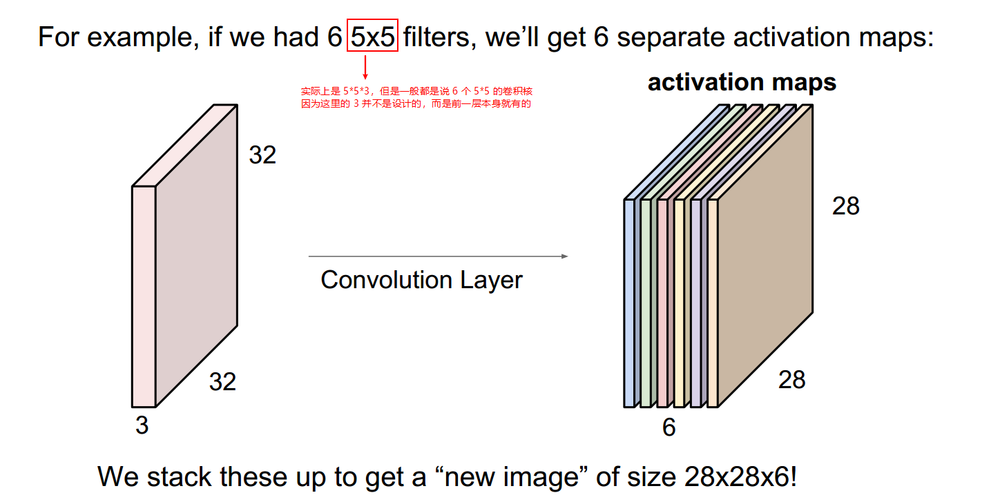

# 5.2 卷积神经——卷积和池化 Convolutional Neural--convolution and pooling

##  5.2.1 回顾 Review

今天我们将学习卷积神经网络是如何工作的。和神经网络一样，我们先从函数角度了解它的工作原理，不作任何大脑的比喻。然后我们会简单介绍这些连接点。

Today we are going to talk about how convolutional neural networks work. Same as with neural networks, we're going to first talk about how they work from a functional perspective without any of the brain analogies, and then we'll talk briefly about some of these connections. 

<table>
    <tr>
        <td >

</td>
    </tr>
</table>

上节课我们介绍了全连接层的概念。对全连接层而言，我们要做的是在这些向量上进行操作。比如，我们有一张图片，三维向量，32\*32\*3大小。我们将所有的像素展开，就可以得到一个3072维的向量，我们得到这些权重，把向量和权重矩阵相乘，这里我们用10*3072，然后就可以得到激活值，这一层的输出。例子中我们用10行数据与这个3072维的输入进行点积运算，从而得到一个数字，这个数字也就是该神经元的值，我们将有10个这样的神经元输出。

Last lecture we talk about this idea of a fully connected layer. For a fully connected layer, what we're doing is we operate on top of these vectors, let's say we have a 3D image,  32 by 32 by 3. We'll stretch all of the pixels out, and then we have this 3072 dimensional vector, and we have these weights, we multiply this by a weight matrix, here for example our $W​$ is 10 by 3072, and we're going to get the activations, the output of this layer. In this case, we take each of our 10 rows and we do this dot product with 3072 dimensional input. And from there we get this one number, that's the value of that neuron, and we're going to have 10 of these neuron outputs.

<table>
    <tr>
        <td >

</td>
    </tr>
</table>

至于卷积层，它和全连接层的主要差别在于我们之前提到的可以保全空间结构。用一章我们之前用过的32\*32\*3的图片，而不是将它展开成一个长向量，我们可以保持图片的结构，这个三维输入的结构。我们的权重是一些小的卷积核，例子中是 5\*5\*3 的大小，我们将这个卷积核在整个图像上滑动，计算出每一个空间定位时的点积结果。接下来就是它们工作的具体细节。

And a convolutional layer, so the main difference between this and the fully connected layer that we've been talking about is that here we want to preserve spatial structure. And so taking this 32 by 32 by 3 image that we had earlier, instead of stretching this all out into one long vector, we're now going to keep the structure of this image, this 3 dimensional input. Our weights are going to be these small filters, so in this case for example, a 5 by 5 by 3 filter, and we're going to take this filter and we're going to slide it over the image spatially and compute dot products at every spatial location. And so we're going to go into detail of exactly how this works.

## 5.2.2 卷积层 Convolutional Layer

<table>
    <tr>
        <td >

</td>
    </tr>
</table>

首先，我们采用的卷积核总是会将输入量扩展至完全。所以它们会是小一些的空间区域，这里是 5*5，而不是输入空间全部大小 32\*32，但他们通常会遍历所有通道，所有采用 5\*5\*3 的大小。然后我们采用这个卷积核，并在给定一个空间区域，在这个卷积核和图像块之间进行点积运算。我们要做的是在图像空间区域上，覆盖这个卷积核，然后进行点积运算，也就是将卷积核每个位置元素和与之对应图像区域的像素值相乘，这个区域是从图像上取出的。经过运算之后会给我们一个点积结果。在这个例子中，我们进行了  5\*5\*3 次计算，之后加上偏置项。这就是卷积核 $W​$ 的基本方法，就是用 $W​$ 的转置乘以 $X​$ 再加上偏置项。

So, our filters, first of all, always extend the full depth of the input volume. And so they're going to be just a smaller spatial area, so in this case 5 by 5, instead of  our full 32 by 32 spatial input, but they 're always    going to go through the full depth. So here we're going to take 5 by 5 by 3. And then we're going to take this filter and at a given spatial location, we're going to do a dot product between this filter and then a chunk of a image. So we're going to overlay this filter on top of a spatial location in the image, and then do the dot product, the multiplication of each element of that filter with each corresponding element in that spatial location that we've just plopped it on top of. And then this is going to give us a dot product. So in this case, we have 5 times 5 times 3, this is the number of multiplications. And then plus the bias term. This is basically taking our filter $W$ and basically doing $W$ transpose times $X​$ and plus bias.

*问题：在做点击运算时，我们是否会把  5\*5\*3 这个块转换成一个向量？*

*Question: When we do the dot product, do we turn the 5 by 5 by 3 into one vector?*

*回答：是可以的，本质上我们就是这么做的。你可以这么考虑，将对应的每个空间位置元素进行相乘然后相加。如果你把在那一点处的卷积核及对应的输入数据块展开为一个向量，再进行点积运算，它们的结果是相同的。*

*Answer: Yeah, in essence that's what you're doing. You can think of it as just plopping it on and doing the element-wise multiplication at each location, but this is going to give you the same result as if you stretched out the filter at that point, stretched out the input volume that it's laid over, and then took the dot product.*

*问题：有什么直观的解释为何这里是 $W​$ 的转置。*

*Question: Is there any intuition for why this is a $W​$ transpose?*

*回答：也不完全是 $W$ 的转置，这只是一个表示方法，是为了让数学运算按照点积的方式进行，所以这取决于你如何定义 $W$，在这个例子中如果我们来看 $W$ 矩阵，针对每一列都进行操作，所以我们只是把列变成了行。这里没有什么直观的解释。我们把卷积核 $W$ 展开，得到一个一维向量，排列一下使它能够进行点积，这就像一个 1\*N 的向量，*

*Answer: This is not really, this is just the notation that we have here to make the math work out as a dot product. So it just depends on whether, how you're representing $W$ and whether in this case if we look at the $W$ matrix, this happens to be each column and so we're just taking the transpose to get a row out of it. There's no intuition here, we're just taking the filters of $W$, and stretching it out into a one dimensional vector, and in order for it to be a dot product, it has to be like a one by N vector.*

*问题：$W​$ 不是 5\*5\*3，而是一个含有75个元素的向量。*

*Question: $W​$ here is not 5\*5\*3, it's 1\*75？*

*回答：确实如此，当我们将 $W​$ 对 $X​$ 进行变换而进行点积运算时，我们首先做的就是把它展开。所以我们取了  5\*5\*3 个值，组成一个长向量。总之，和刚才的问题类似，在这里我们实质上的操作，是将卷积核紧挨着图片的一个空间位置，然后将所有对应的元素分别相乘，但为了表述简洁，和我们之前讨论的相似，我们可以把没一个都取出并铺展开，但是要确定维数要正确变换，然后可以实现一个点积的结果。*

*Answer: That's the case, if we're going to do this dot product of $W​$ transpose times $X​$, we have to stretch it out first before we do the dot product. So we take the 5 by 5 by 3, and stretch it out into a long vector. Similar to the other question, the actual operation that we're doing here is plopping our filter on top of a spatial location in the image and multiplying all of the corresponding values together, but in order to make it kind of an easy expression, similar to what we've seen before, we can also just stretch each of these out, make sure that dimensions are transposed correctly so that it works out as a dot product.*

*问题：我们应该将核旋转 180 度去更好地符合卷积的定义？*

*Question: Should we rotate the kernel by 180 degrees to better match the convolution?*

*回答：我们稍后会去看这个公式。但是我们使用卷积时，是用一种不太严格的定义去描述我们的操作，所以对信号处理领域的人来说，如果你想把我们实际上的操作称之为卷积，你就需要卷积核来进行卷化，但是绝大多时候，我们不需要担心这一点，我们只是做了这样的操作，广义上和卷积有些类似。*

*Answer: We'll also show the equation for this later, but we're just using convolution as kind of a looser definition of what's happening. So for people form signal processing, what we are actually technically doing if you want to call this a convolution, is we're convolving with the flipped version of the filter. But for the most part, we just don't worry about this, and we just do this operation, and it's like a convolution spirit.*

<table>
    <tr>
        <td >

</td>
    </tr>
</table>

我们接下来要讨论的是将这个卷积核从左上角的边角处开始，并让卷积核遍历输入的所有像素点。在每一个位置，我们都进行点积运算，每一次运算都会在我们输出激活映射中产生一个值。之后我们再继续滑动卷积核，最简单的方式就是一个像素一个像素地滑动，我们持续地进行这样的操作，并相应地填满我们的输出激活映射。你可能意识到输出映射的维数和想象的并不符合。我们的输入是 32\*32，输出是 28\*28，我们将会对这个问题用例子来解释这里的维数变化的机制，但是首先需要决定是如何滑动卷积核的。你是按像素逐个滑动的还是别的滑动方式，比如你可以没经过两个输入值进行一次滑动，也就是每次滑动两个像素点，这样你得到不同尺寸大小的输出，完全取决于滑动的方式。但是一般而言会依照栅格形式来进行滑动。

So what we're going to do is taking this filter, start at the upper left corner and basically center our filter on top of every pixel in this input volume. And at every position, we're going to do this dot product and this will produce one value in our output activation map. And then we're going to just slide this around. The simplest version is just at every pixel, we're going to do this operation and fill in the corresponding point in our output activation. You can see here that the dimensions are not exactly what would happen. We have 32 by 32 in the input, and have 28 by 28 in the output. We'll go into examples later of the math of exactly how this is going to work out dimension-wise, but basically you have a choice of how you're going to slide this, whether you go at every pixel or whether you slide two input values over at a time, two pixels over at a time, and so you can get different size outputs, depending on how you choose to slide. But basically you're doing this operation in a grid fashion.

<table>
    <tr>
        <td >

</td>
    </tr>
</table>

就像我们刚才看到的，我们采用了一卷积核，然后将它在图像的整个平面进行滑动，然后我们输出它的激活映射，它里面的值就是卷积核在每个位置求得的结果。当我们在处理一个卷积层时，我们希望用到多种卷积核，因为每一个卷积核都可以从输出中得到一种特殊的模式或者概念，所以我们会有一组卷积核。这里我们用第二个卷积核，也就是图中绿色的卷积核，同样也是 5\*5\*3 的大小，将它进行滑动，遍历输入层的所有位置，然后得到第二个相同尺寸的绿色的激活映射，

What we just saw earlier, this is taking one filter, sliding it over all of the spatial locations in the image, and then we're going to get this activation map out, which is the value of that filter at every spatial location. And  when we're dealing with a convolutional layer, we want to work with multiple filters, because each filter is kind of looking for a specific type of template of concept in the input volume. And so we're going to have a set of multiple filters, and here we're going to take a second filter,  which is again 5\*5\*3, we're going to slide this over all of the spatial locations in input volume, and then get out this second green activation map also of the same size.

<table>
    <tr>
        <td >

</td>
    </tr>
</table>

我们可以按照同样的方法使用多个卷积核进行计算，比如，我们有6个卷积核，每个尺寸都是 5\*5\*3，这样我们就会得到一个 6 层的激活映射。总之，我们会得到这么一个 28\*28\*6 的输出。

And we can do this for as many filters as we want to have in this layer. For example, if we have 6 filters, 6 of these 5 by 5 filters, then we're going to get in total 6 activation maps out. We are going to get this output volume that's going to be basically 6 by 28 by 28.

<table>
    <tr>
        <td >

</td>
    </tr>
</table>

我们来简单描述一下在卷积神经网络中我们是如何使用这些卷积层的，我们的 ConvNet 基本上是由多个卷积层组成的一个序列，它们依次堆叠，就想我们之前在神经网络中那样堆叠简单的线性层一样。之后我们将用激活函数对其进行逐一处理，比如说，一个 ReLU 激活函数。我们得到一些比如 Conv 和 ReLU 的东西，以及一些池化层，之后会得到一系列的这些层，每一个都会有一个输出，该输出又作为下一个卷积层的输入。

So a preview of how we're going to use these convolutional layers in our convolutional network is that our ConvNet is basically going to be a sequence of these convolutional layers stacked on top of each other, same way as what we had with the simple linear layers in their neural network. And then we're going to intersperse these with activation functions, for example, a ReLU activation function. And so we're going to get something like Conv, ReLU, and usually also some pooling layers, and then you're just going to get a sequence of these, each creating an output that's now going to be the input of the next convolutional layer.

<table>
    <tr>
        <td >

</td>
    </tr>
</table>

我之前说过这些层采用多个卷积核。没个卷积核会产生一个激活映射。你可以观察这些层，然后把它们叠加成一个 ConvNet，最后的记过是你完成了对这组卷积核的学习，前面几层的卷积核一般代表了一些低阶的图像特征，比如说一些边缘特征，而对于那些中间层，你可以得到一些更加复杂的图像特征，它的内容看起来可能更加丰富，比如边角和斑点等。而对于那些高阶的特征，你可以获得一些比斑点之类的更加丰富的内容。我们会在后面的课程中详细讨论你是如何能直接观察到这些图像特征，并且尝试去解释神经网络在学习何种特征。但是当前最重要的是明白这些特征大致上代表了什么，当你有了这些堆叠在一起的层时，你要知道他们是一些从简单到复杂的特征序列。

And so each of these layers, as I said earlier, has multiple filters. And each of the filters is producing and activation map. When you look at multiple of these layers stacked together in a ConvNet, what ends up happening is you end up learning this hierarching of filters, where the filters at the earlier layers usually represent low-level features that you're looking for. Things kind of like edges, and at the middle-level, you're going to get more complex kinds of features, maybe it's looking more for things like corners and blobs and so on. And then at higher-level features, you're going to get things that are starting to more resemble concepts than blobs. And we'll go into more detail later in the class in how you can actually visualize all these features and try and interpret what kind of features your network is learning. But the important thing for now is just to understand that what these features end up being when you have a whole stack of these is these types of simple to more complex features.

<table>
    <tr>
        <td >

</td>
    </tr>
</table>

*问题：增加深度的出发点是什么？*

*Question: What's the intuition for increasing the depth each time?*

*回答：这里针对初始层我有6个卷积核，接着下一层有10个卷积核。这主要是出于一种架构设计层面的考虑。在实际操作中，有的人发现了这种网络结构更加有效，之后我们会举例说明多种卷积神经网络结构之间的差异，还有如何去设计这些结构，以及为什么这些特殊的结构会比其他的更有效。但是基本的考虑是你可以选择不同的设计方式，针对一个卷积神经网络，卷积核大小，滑动步长，多少个卷积核，我们会在后面讨论这个。*

*Answer: Here I had 6 filters in the original layer and then 10 filters in the next layer. This is mostly a design choice. People in practice have found certain types of these configurations to work better. Later on we'll go into case studies of different kinds of convolutional neural network architectures and design choices for these and why certain ones work better than others. But basically the choice of, you're going to have many design choices in a convolutional neural network, the size of filter, the stride, how many filters you have, and we'll talk about this all more later.*

<table>
    <tr>
        <td >

</td>
    </tr>
</table>

这些我们堆叠在一起的卷积层上，看到了我们如何从更简单的特征开始，然后将他们集成到更复杂的特征上。实际上，这与Hubel和Wiesel在他们的实验观察到的是一致的。在早期阶段，我们使用这些简单神经元然后可以推广到更复杂神经元。所以，即使我们没有明确地强制我们的ConvNet模型去学习这些类型的特征，实际上，当你给他这种类型的层次结构，并且使用反向传播进行训练，这些类型的卷积核最终也会学到

Each of these convolutional layers that we have stacked together, we saw how we're starting with more simpler features and then aggregating these into more complex features later on. And so in practice this is compatible with what Hubel and Wiesel noticed in their experiments, that we had these simple cells at the earlier stages of processing followed by more complex cells later on. So even though we didn't explicitly force our ConvNet to learn these kinds of features, in practice when you give it this type of hierarchical structure and train it using backpropagation, these are the kinds of filters that end up being learned.

*问题：在这些可视化中我们看到了什么？*

*Question: What are we seeing in these visualizations?*

*回答：在这些可视化图像中，如果我们看 Conv1 第一个卷积层，这些网格中的每个部分都是一个神经元，所以我们在这里可视化的就是这个输入长什么样子，它将特定神经元的激活函数最大化。你会得到什么样的图像能给你最大值，并使神经元拥有最大值。我们做这个的方式基本上是通过一个特定的神经元激活函数开始反向传播，然后观察输入中的什么触发之后会产生这个神经元的最大值。关于如何创建这些可视化图像，这些我们将会在之后的课程中更加深入地讨论。基本上，这个网格的每个元素，都在展示了输入会长什么样子是最大化了神经元的激活函数。所以从某种意义上来说，神经元在寻找什么。*

*Answer: In these visualizations, if we look at Conv1, the first convolutional layer, each part of this grid is a one neuron. So what we've visualized here is what the input looks like that maximizes the activation of that particular neuron. So what sort of image you would get that would give you the largest value make that neuron fire and have the largest value. And the way we do this is basically by doing backpropagation from a particular neuron activation and seeing what in the input will trigger, will give you the highest values of this neuron. And this is something that we'll talk about in much more depth in a later lecture about how ew create all of these visualizations. But basically each element of these grids is showing what in the input would look like that maximizes the activation of the neuron. So in a sense, what is the neuron looking for.*

<table>
    <tr>
        <td >

</td>
    </tr>
</table>

这是由每个卷积核产生的一些激活函数映射的例子。我们可以把可视化的东西放在最上面，有一整排 5\*5 的过滤器，这基本上式一个经过训练的 ConvNet 的实际案例，其中每一个都是 5\*5 的卷积核的样子，然后我们在一张图像上进行卷积。在这个例子中，我认为这个激活函数看起来像是一个小汽车的一角，像是车灯。这里有一个例子，如果我们看第一个图像，这个红色的卷积核，红色框的卷积核，我们会看到它正在寻找看起来像是一个定向边缘的模板，如果你把这个卷积核滑过图像，在这种边缘的地方会得到一个较高的值。所以这些激活函数映射的每一个都对应滑动这些卷积核的一个输出，以及这些卷积核产生输出的位置，或者说图像中这类型的模板更能表示的地方。我们叫这些卷积，是因为这与两个信号的卷积有关，所以很早就有人提出，这个基本上就是卷积公式。这对于在信号处理中见过卷积的人来说显而易见，当然在实践中，它实际上更像是一个相关性，我们将这个卷积核的翻转形式进行卷积，但这有一些微妙，这些对于课程目的不是很重要。但是如果你写出来你在做什么，那就符合卷积的定义了。但这里需要一个卷积核，在图像空间上滑过，并且计算出每个位置的点积。

Here is an example of some of the activation maps produced by each filter. We can visualize up here on the top, we have this whole row of example five by five filters, and so this is basically a real case from a trained ConvNet, where each of these is what a five by five filter looks like, and then as we convolve this over an image, in this case I think it's like a corner of a car, the car light, what the activation looks like. And so here for example, if we look at this first one, this red filter, filter like with a red box around it, we'll see that it's looking for, the template looks like an edge, an oriented edge. And so if you slide it over the image, it will have a high value, a more white value where there are edges in this type of orientation. And so each of these activation maps is kind of the output of sliding one of these filters over and where these filters are causing, where this sort of template is more present in the image. And the reason we call these convolutional is because this is related to the convolution of 2 signals, and so someone pointed out earlier that this is basically this convolution equation over here, for people who have seen convolutions before in signal processing, and in practice it's actually more like a correlation where we're convolving with the flipped version of the filter, but this is kind of a subtlety, it's not really important for the purpose of this class. But if you write out what you're doing, which is the standard definition of a convolution. But this is just taking a filter, sliding it spatially over the image and computing the dot product at every location.

