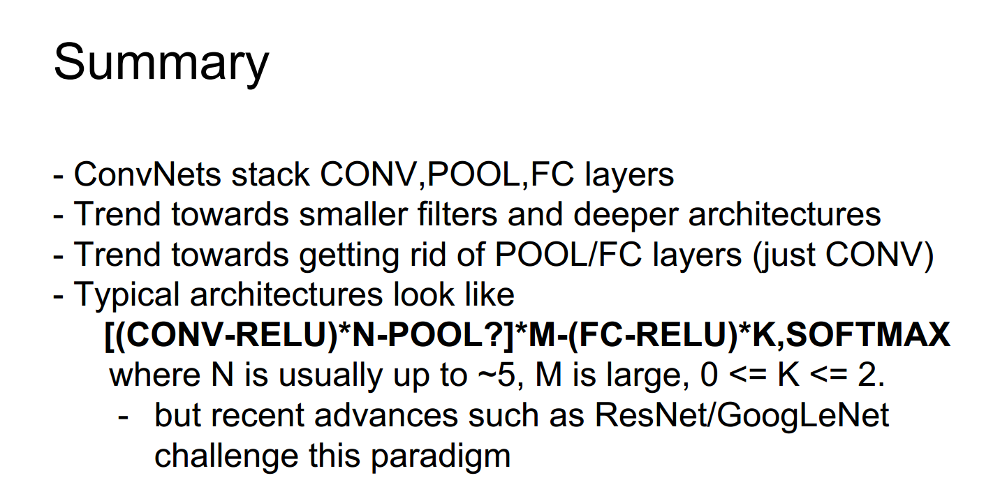

#  5.3 卷积神经网络——大脑视角和池化 Convolutional Neural Networks--Brain View and Pooling

##  5.3.1 大脑视角 The Brain/Neuron View of CONV Layer

<table>
    <tr>
        <td >

</td>
        <td >

</td>
    </tr>
</table>

现在换个角度，从大脑神经元的角度来分析一个卷积层。我们看到，在每一个位置，我们取一个卷积核与图像的特定部分之间的一个点积从而得到一个数值结果。同样的思想来取这样一些输入值和权值矩阵 $W$ 之间的点积，这些卷积核的权值，也就是这些突触的权值，然后得到一个结果值。但是它们主要的区别在于神经元具有局部的连接性，所以我们不关注输入图片的全部，而是关注图像空间的一个局部区域。所以在某个区域，得到这个神经元被激发的程度。现在你保留这个空间结构，基于之后各层的激活映射进行推导。接下来讲一些术语，有一个 5\*5 的卷积核，我们也可以称它为这个神经元的一个 5\*5 的感受野，感受野是指这个神经元所能接受到的视野。

So now if we look a little bit at kind of the brain neuron view of a convolutional layer, similar to what we looked at for the neurons in the last lecture. What we have is that at every spatial location, we take a dot product between a filter and a specific part of the image, and we get one number out from there. And this is the same idea of doing these types of dot products, taking your input, weighting it by these $W$s, value of your filter, these weights that are the synapses, and getting a value out. But the main difference here is just that now your neuron has local connectivity. So instead of being connected to the entire input, it's just looking at a lcoal region spatially of your image. So this looks like at a local region and then now you're going to get how much this neuron is being triggered at every spatial location in your image. So now you preserve the spatial structure and you are able to reason on top of these kinds of activation maps in later layers. And just a little bit of terminology, we have this 5 by 5 filter, we can also call this a 5 by 5 receptive field for that neuron, because the receptive field is input field that this field of vision that this neuron is receiving.

<table>
    <tr>
        <td >

</td>
        <td >

</td>
    </tr>
</table>

正如我们之前所说我们将会得到的输出将会是这个大小，从空间上来说，比如 28\*28，卷积核的数量就是所谓的深度，比如说一共有5层的卷积核，那么我们将会得到一个 28\*28\*5 的三维网格。如果你看一下这些卷积核，在输出空间的具体某个区域，沿着深度方向，这5个神经元，基本上可以把它理解为所有这些都作用于输入图片的同一片区域，但是他们有不同的功用，作用于图像的相同区域中。另外值得注意的是，与我们之前提到过的全连接层做一个比较。之前那个例子，如果我们看一下每一个神经元，在激活区域或者输出中，每一个神经元都连接着平展后的所有输入，所以神经元是与全体输入量都发生关联，而不像卷积核这样只与图像的一个局部区域发生关联。

As we talked about what we're going to get at this output is going to be this volume where spatially we have, let's say 28 by 28, and then our number of filters is the depth, and so for example with 5 filters what we're going to get out is this 3D grid, that's 28 by 28 by 5. And if you look at the filters across in one spatial location of the activation volume and going through depth these 5 neurons, basically the way you can interpret this is ther're all looking at the same region in the input volumn, but they're just looking for different things. They are different filters applied to the same spatial location in the image. And just a reminder again kind of comparing with the fully connected layer that we talked about earlier. In that case, if we look at each of the neurons in our activation or output, each of the neurons was connected to the entire stretched out input, so it looked at the entire full input volume compared to now where each one just looks at this local spatial region.

# 5.3.2 池化 Pooling

我们刚才深入到很多关于这些卷积层构造的细节中，现在我要简单地提及一下其他的组成整个卷积网络的各个层。我们有卷积层，每隔几个卷积层，就会有些池化层夹在中间，还有些非线性层。

We've gone into a lot of detail in what these convolutional layers look like, and now I'm going to go briefly the other layers that we have that form this entire convolutional network. We have convolutional layers interspersed with pooling layers once in a while, as well as these non-linearities.

这些池化层要做的是要让所生成的表示更小且更容易控制。它降低了采样率，比如说对 224\*224\*64 的输入，进行空间上的下采样处理。所以得到一个 112\*112 的结果。需要注意的一点是，不在深度方向上做池化处理，只在平面上做。所以输入和输出的深度是一样的。

So what the pooling layers do is that they make the representations smaller and more manageable. It does exactly just downsamples and takes your input volume, for example,  224 by 224 by 64, and spatially downsamples this. so in the end you'll get out 112 by 112. And it's important to note this doesn't do anything in the depth, we're only pooling spatially. So the input depth is the same as the output depth.

<table>
    <tr>
        <td >

</td>
    </tr>
</table>

举例来说，最常见的方法就是最大池化法。在这个例子中，池化层也有一个卷积核的大小，而且卷积核的大小和我们索要池化处理的区域大小是相同的，在这个例子中，如果我们使用 2\*2 的卷积核，并且设定步长为2，滑过整个输入部分，不过我们不进行点积运算，我们只提取其中的最大值，所在图像区域的输入的最大值。

For example, a common way to do this is max pooling, So in this case, out pooling layer also has a filter size and this filter size is going to be the region at which we pool over, so in this case, if we have 2 by 2 filters, and we also have stride 2 in this case, we're going to slide this along our input volume, but here instead of doing the dot products, we just take the maximum value, of the input volume in that region.

*问题：这是否是通常的做法，就是设定步长，使他们不互相重叠。*

*Question: Is it typical to set up the stride so that there isn't an overlap?*

*回答：是的，对于池化层来说是这样。我认为更通常的做法是让他们没有任何重叠，你可以这样认为我们希望进行下采样处理，对于给定的一个区域这样避免重叠的处理和只用一个数值来标识整个区域是有道理的，然后我们就接着看下一个区域，并且继续下去。*

*Answer: Yeah, so for the pooling layers it is, the more common thing to do is to have them not have any overlap, and the way you can think about this we want to downsample and so it makes sense to kind of look at this region and just get one value to represen this region and then just look at the next region and so on.*

*问题：最大池化为什么表现比平均池化效果好？*

*Question: Why is maxpooling better than taking the doing something like average pooling?*

*回答：平均池化不是不能用。但最大池化用得更多因为它有这样的意义，我有神经元的激活值，每个值都在一定程度上表示了在这个位置上某个神经元的激发程度， 或者说某组卷积核的激发程度，你可以把最大池化看成这组卷积核在图像任意区域的受激程度的表示。所以如果要做检测，识别之类的任务，最大值池化是更直观的，不管你要从图片里找光线还是其他类似的信息，不管在区域内什么地方用一个最大值来激活它。*

*Answer: Average pooling is also something you can do, and intuition behind why max pooling is commonly used is that it can have this interpretation of, these are actications of my neurons, and each value is kind of how much this neuron fired in this location, how much this filter fired in this location. And you can think of max pooling as saying, giving a signal of how much did this filter fire at any location in this image. And if we're thinking about detecting, doing recognition, this might make some intuitive sense where you're saying, whether a light or whether some aspect of your image that you're looking for, whether it happens anywhere in this region we want to fire at with a high value.*

- 输入大小：$W_1 * H_1 * D_1$
- 需要三个超参数：
  - 卷积核大小 $F$
  - 步长 $S$
- 输出大小：$W_2 * H_2 * D_2$，其中：
  - $W_2 = (W_1 - F)/S + 1​$
  - $H_2 = (H_1 - F)/S + 1$
  - $D_2 = D_1​$
- 没有引进新的参数
- 池化层不进行零填充

<table>
    <tr>
        <td >

</td>
    </tr>
</table>

<table>
    <tr>
        <td >

</td>
    </tr>
</table>

这样我们讲完了这些卷阶层，ReLU层和上节课讲的朴素的神经网络是一样的。所以像这样分散池化来实现降采样。然后是得到一个全连接层。跟我们之前看到的全连接层是一样的。在这里我们把卷积网络最后一层的输出，即一个固定尺寸的矩阵，我们知道它的长宽高，把这样的矩阵直接拉平，这样就获得了一组一维输入与朴素神经网络连接，得到卷积网络最后的全连接层，即与每一个卷积图输出相连接的权重。你可以理解成，现在可以这样讲，我们不再需要保全之前的空间结构了，而在最后一层，把所有的内容汇聚到一起，我们想根据这些信息来得到一些结论。这样你得到的就是，类似之前看到的那些分值一样的输出。

So now we have talked about these convolutional layers, the ReLU layers were the same as what we had before the base neural network that we talked about last lecture. So we intersperse these and then we have a pooling layer every once in a while when we feel like downsampling. And the last thing is that at the end we want to have a fully connected layer. And so this will be just exactly the same as the fully connected layers that you've seen before. So in this now what we do is we take the convolutional network output, at the last layer we have some volume, we're going to have width by height by some depth, and we just take all of these and we essentially just stretch these out, and so now we're going to get the same kind of basically 1D input that we're used to for a vanilla neural network, and then we're going to allpy this fully connected layer on top, so now we're going to have connections to every one of these convolutional map outputs. And so what you can think of this is basically, now instead of preserving, before we were preserving spatial structure, but at the last layer at the end, we want to aggregate all of this together and we want to reason basically on top of all of this as we had before. And so what you get from that is just our score ouputs as we had earlier.

*问题：这一列怎么理解，比如这个pool。*

*Question: How do we interpret this column, for example at pool.*

*回答：这里我们展示的每一列都是激活映射的输出，某一层的输出。一开始，我们有个车，经过卷积层，得到的是每一个滑动输入图像的卷积核的激活映射，把激活映射送进 ReLU，得到一些这样的值，在池化层得到的数据就是前面ReLU层的输出，拿到ReLU层的输出然后池化之。这就做了降采样，取出所有卷积核对应位置上的最大值，如果看下这个池化层的输出，比如，最后那一列POOL，看起来和前一层的ReLU输出是一样的，只是做了降采样和取了每个空间位置上的最大值。这就是两者之间细微的差别。*

*Answer: And so what we're showing here is each of these columns is the output actication maps, the output from one of these layers. And so starting from the beginning, we have our car, after the convolutional layer we noe have these activation maps of each of the filters slid spatially over the input image. Then we pass that through a ReLU, so you can see the values coming out from there. And so what you get for the pooling layer is that it's really just taking the output of the ReLU layer that came just before it and then it's pooling it. So it's going to downsample it, and then it's goint to take the max value in each filter location. And so now if you look at this pool layer output, for example, the last one, it looks the same as this ReLU output except that it's downsampled and that it has this kind of max value at every spatial location, and so that's the minor difference that you'll see between those two.*

*问题：看起来好像取到了很少量的信息，那怎么根据这个来做区分？*

*Question: Now this looks like just a very small amount of information, so how can it know to classify it from here?*

*回答：你可以这么想，每一个池化层输出的值，实际上是数据经过了整个网络处理后累积的结果。在最顶层，每一个值都代表了上一阶的某个概念，就想之前看到过的HUbel和Wiesel，和类似的这些层级卷积核，可以在最底层寻找边缘，或者一些简单的结构。经过卷积层，输出的第一列小图，一般是某些特定的激活表征，比如边缘在图像的各个位置的体现。越往后，得到的是更复杂更高层的表示，下一个卷积层，则会表现出比如图片中的一些边角区域，所有这些都有含义。输入不再是原始图片，而是之前的输出，比如边缘的表示图，它是在边缘图上进一步计算来得到的更复杂的内容，检测更复杂的事物。这样当你到达最后一个池化层的时候，每个值都代表了一组符合模板的激活情况。这样得到的全连接层把所有的信息聚合到一起，得到一组分类的分值。每个值代表复合的复杂概念的受激程度。*

*Answer: The way that you should think about this is that each of these values inside one of these pool outputs, is actually, it's the accumulation of all the processing that you've done throughout this entire network, it's at the very top of your hierarchy and so each actually represents kind of a higher lever concept. So we saw before, for example, Hubel and Wiesel, and building up these hierarchical filters, where at the bottom level we're looking for edges, or things like very simple structures, like edges. And so after you convolutional layer, the outputs that you see here in this first cloumn is basically how much do specific, for example, edges, fire at different locations in the image. But then as you go through you're going to get more complex, it's looking for more complex things, and so the netxt convolutional layer is going to fire at how much, let's say certain kinds of corners show up in the image, because it's reasoning. Its input is not the original image, it input is the output, it's already the edge maps, so it's reasoning on top of edge maps, and so that allows it to get more complex, detect more complex things. And so by the time you get all the way up to the last pooling layer, each value is representing  how much a relatively complex sort of template is firing. And because of that now you can just have a fully connected layer, you're just aggregating all of this information together to get a score for you class. So each of these values is how much a pretty complicated complex concept is firing.*

*问题：这一列怎么理解，比如这个pool。*

*Question: How do we interpret this column, for example at pool.*

*回答：这里我们展示的每一列都是激活映射的输出，某一层的输出。一开始，我们有个车，经过卷积层，得到的是每一个滑动输入图像的卷积核的激活映射，把激活映射送进 ReLU，得到一些这样的值，在池化层得到的数据就是前面ReLU层的输出，拿到ReLU层的输出然后池化之。这就做了降采样，取出所有卷积核对应位置上的最大值，如果看下这个池化层的输出，比如，最后那一列POOL，看起来和前一层的ReLU输出是一样的，只是做了降采样和取了每个空间位置上的最大值。这就是两者之间细微的差别。*

*Answer: And so what we're showing here is each of these columns is the output actication maps, the output from one of these layers. And so starting from the beginning, we have our car, after the convolutional layer we noe have these activation maps of each of the filters slid spatially over the input image. Then we pass that through a ReLU, so you can see the values coming out from there. And so what you get for the pooling layer is that it's really just taking the output of the ReLU layer that came just before it and then it's pooling it. So it's going to downsample it, and then it's goint to take the max value in each filter location. And so now if you look at this pool layer output, for example, the last one, it looks the same as this ReLU output except that it's downsampled and that it has this kind of max value at every spatial location, and so that's the minor difference that you'll see between those two.*

## 5.3.2 总结 Summary

<table>
    <tr>
        <td >

</td>
    </tr>
</table>

总结一下，今天讲了卷积神经网络的工作原理，怎么把卷积和池化层堆叠起来，最后怎么与全连接层结合。小尺寸卷积核和更深的网络结构是一个趋势，后面会将一些这方面的例子。还有一个趋势是完全弃用池化和全连接层，而只保留卷积层，形成非常深的卷积网络，我们以后会讲。典型结构是怎么样的，就想之前说的，卷积 ReLU重复N次，隔几次做一个池化，如此反复，最后来到全连接ReLU层，像之前我们讲的，加一层两层，或者几层，最后用softmax得到你的类别分数。比如五类十类这样的，所以你把卷积ReLU采样序列和最后几个全连接层堆叠在一起，得到一个很深的卷积网络。不过后面我们会说到一些新的结构，比如ResNet 和GoogLeNet使用了不同的结构，而不是这种套路。

In summary, so today we talked about how convolutinal neural networks work, how they're stacks if these convolutional layers and pooling layers, followed by fully connected layers at the end. There's been a trend towards having smaller filters and deeper architectures, so we'll talk more about case studies for some of these later on. There's also been a trend towards getting rid of these pooling and fully connected layers entirely, so just keeping these Conv layers, very deep networks of Conv layers, so again we'll discuss all of this later on. And then typical architectures again look like this, as we had earlier, Conv, ReLU for some N number of steps followed by a pool every once in a while, this whole thing repeated some number of times, and then followed by fully connected ReLU layers that we saw earlier, one or two or just a few of these and then a softmax at the end for your class scores. Some typical values, you might have N up to five of these, you're going to have pretty deep layers of Conv, ReLU, pool sequences, and then usually just a couplt of these fully connected layers at the end. And we'll also go into some newer architectures like ResNet and GoogLeNet, which challenge this and will give pretty different types of architectures.