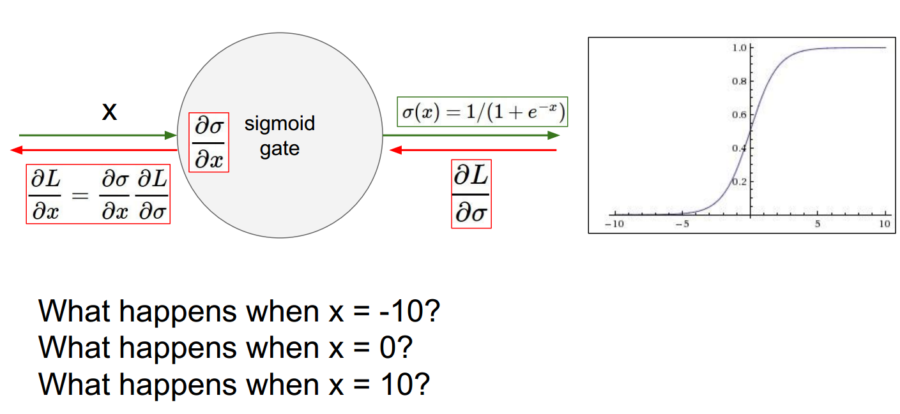

# 6.1 训练神经网络——激活函数 Training Neural Networks -- Activation Function

##  6.1.1 回顾 Review

<table>
    <tr>
        <td >

</td>
        <td >

</td>
        <td >

</td>
    </tr>
    <tr>
        <td >

</td>
        <td >

</td>
        <td >

</td>
    </tr>
    <tr>
        <td >

</td>
    </tr>
</table>

今天我们将学习有关如何训练神经网络的一些细节问题。我们已经讨论过如何使用计算图来表达一个函数，其实任何函数我们都可以用计算图来表达。并且我们已经很明确地探讨过神经网络，就是一种计算图，它包含若干个线性层，而层与层之间通过非线性函数进行连接实现堆叠。我们在上节课也介绍了卷积神经网络，这是一种特殊的网络，它使用卷积层，在贯穿整个网络的层次结构中，保持输入的空间结构。这里我们看到一个卷积层，卷积层输出的每个激活图，是通过使用一个权重卷积核在输入矩阵的空间位置上滑动而产生的。我们通常会看到每个卷积层会有多个卷积核，每个卷积核会产生各自独立的激活图。所以我们可以从一个具有特定深度的输入得到一个激活图作为输出，其中一些空间中的维度被保留，而这一层的深度等于卷积核的个数。我们希望实现的是，学习所有这些权重或参数的值，学习所有这些权重或参数的值，然后我们可以通过优化来更新网络参数，这点我们在之前的课上提到过一点。因此我们希望在损失区域中找到一个点，使得产生损失最低。我们通过往负梯度方向更新来实现这个想法。整个过程我们称为最小批量随机梯度下降，它的步骤是对数据进行连续的批量抽样。我们通过使用计算图或神经网络将数据进行正常传播，得到损失值，通过整个网络的反向传播来计算梯度。然后使用这个梯度来更新网络中的参数或权重。

Today we're going to get into some of the details about how we train neural networks. We've talked about how to express a function in terms of a computational graph, that we can represent any function in terms of a computational graph. And we've talked about more explicitly about neural networks, which is a type of graph, where we have these linear layers that we stack on top of each other with nonlinearities in between. And we also talked last lecture about convolutional neural networks, which are particular type of network that uses convolutional layers to preserve the spatial structure throughout all the hierarchy of the network. And so we saw exactly how a convolutional layer looked where each activation map in the convolutional layer output is produced by sliding a filter of weights over all of the spatial locations in the input. And we also saw that usually we can have many filters per layer, each of which produces a separate activation map. And so what we can get is from an input with a certain depth, we'll get an activation map output, which has some spatial dimension that's preserved, as well as the depth is the total number of filters that we have in that layer. And so what we want to do is we want to learn the values of all of these weights of parameters, and we saw that we can learn out network parameters through optimization, which we talked abut little bit earlier in the course. And so we want to get a point in the loss landscape that produces a low loss, and we can do this by taking steps in the direction of the negative gradient. And the whole process we actually call a mini-batch stochastic gradient descent where the steps are that we continuously we sample a batch of data. We forward prop it through our computational graph or our neural network, we get the loss at the end, we backprop through our network to calculate the gradients. And then we update the parameters or the weights in out network using this gradient.

## 6.1.2 总览 Overview

<table>
    <tr>
        <td >

</td>
    </tr>
</table>

从现在开始的后面几节课我们将讨论一些网络训练过程中的细节。这包括我们在刚开始要如何建立神经网络，选择什么样的激活函数，以及怎么做数据预处理，权重个初始化，正则化和梯度检查。我们还会讨论训练中的动态变化，如何监控这个学习过程，如何选择参数，特定更新规则，怎么做超参数优化来选取最佳超参数。随后我们将介绍模型评估和模型集成。

For the next couple of lectures we're going to talk about some of the details involved in training neural networks. And so this involves things like how do we set up our neural network at the beginning, which activation functions that we choose, how do we preprocess the data, weight initialization, regularization, gradient checking. And we'll also talk about training dynamics. How do we babysit the learning process, how do we choose how we do parameters updates, specific parameter update rules, and how do we do hyperparameter optimization to choose the best hyperparameters. And we'll also talk about evaluation and model ensembles.

<table>
    <tr>
        <td >

</td>
    </tr>
</table>

第一部分我们将激活函数，数据预处理，权重初始化，批量归一化，训练过程监控，超参数优化。

Today in the first part we will talk about activation functions, data preprocessing, weight initialization, batch normalization, babysitting the learning process, and hyperparameter optimization.

## 6.1.3 激活函数 Activation Functions

<table>
    <tr>
        <td >

</td>
        <td >

</td>
    </tr>
</table>

首先讲讲激活函数。我们之前看到了任意特定层是如何由输入产生输出的。在全连接层或者卷积层，我们将输入乘上权重值，然后将结果输入一个激活函数或者非线性单元。这里有一些例子，我们在之前的一些例子中使用sigmoid，我们也看到过非线性ReLU。今天我们将看到更多不同的非线性函数，并在他们之间进行权衡。

So first activation functions. We saw earlier how out of any particular layer we have the data coming in. We multiply by our weight in fully connected or a convolutional layer. And then we'll pass this through an activation function or nonlinearity. And we saw some examples of this, we use sigmoid previously in some of our examples, we also saw the ReLU nonlinearity. And today we'll talk more about different choices for these different nonlinearities and trade-offs between them.

首先是sigmoid函数。sigmoid的函数表达式是$1/(1+e^{-x})$。每一个与元素输入到sigmoid非线性函数中，每个元素被压缩到[0, 1]范围内。如果你有一个非常大的输入值，那么输出将会十分接近于1，如果有非常小的输入值，输出接近0。在横坐标接近于0的区域中，我们可以将这部分看做是线性区域，它有点像线性函数。而且它曾经一度非常流行，因为sigmoid函数在某种意义上，可以被看作是一种，神经元的饱和放电率。如果他是一个介于0和1的值，你可以认为他是一个放电率。稍后我们将介绍其他非线性函数，例如ReLU，从生物学上而言是更合理的。它确是有一种解释，你可以去查查资料。如果我们更加深入地研究这个非线性函数，实际上它存在着若干个问题。

So first, sigmoid. Sigmoid function is as we have up here, $1/(1+e^{-x})$, and what this does is it takes each number that's input into the sigmoid nonlinearity, so each element, and the elementwise squashes these into this range [0, 1], using this function here. And if you get very high values as input, then the output is going to be something near one, if you get very negative values, it's going to be near zero. And then we have this regime near zero that it's in a linear regime, it's looks a lit like a linear function. And this is been historically popular, because sigmoids, in a sense you can interpret them as a kind of a saturating firing rate of a neuron. If it's something between zero and one, you can think of it as a firing rate. We'll talk later about other nonlinearities, like ReLUs that in practice, actually turned out to be more biologically plausible, but this does have a kind of interpretation that you could make. So if we look at this nonlinearity more carefully, there's several problem that there actually are with this. 

<table>
    <tr>
        <td >

</td>
        <td >

</td>
    </tr>
</table>

首先是饱和神经元将使得梯度消失。这是一个sigmoid门，也就是计算图中的一个节点，我们将数据X作为输入，然后我们可以得到从sigmoid门传出的输出。那么它所返回的梯度流是什么样的？我们让L对sigma求偏导，上游梯度往回传播，然后乘上sigama对x的偏导。这是一个局部sigmoid函数的梯度，我们将它们链接起来，作为传递回来的下游梯度。当x是一个绝对值很大的负值，梯度的取值如何？零。因为这个负值太接近sigmoid函数的负饱和区域，这个区域本质上是平的，所以梯度会变成0。我们将返回的上游梯度，乘以一个约等于0的数，所以会得到一个非常小的梯度。经过链式法则之后会让梯度流消失，因此零梯度便会传递到下游的结点。那么当输入X等于0是又怎样？这个区域在0附近，你将得到一个合理的梯度，并可以很好地进行反向传播。当输入等于10时会怎样？零。

The first is that saturated neurons can kill off the gradient. If we look at a sigmoid gate, a node in our computational graph, and we have our data X as input into it, and then we have the output of the sigmoid gate coming out of it. What does the gradient flow look like as we're comin back? We have dL over d sigma, the upstream gradient coming down, and then we're going to multiply this by dSigma over dX. This will be the gradient of a local sigmoid function. And we're going to chain these together for our downstream gradient that we pass back. When X is very negative, what does this gradient look like? zero. The gradient become zero because in this negative, very negative region of the sigmoid, it's essentially flat, so the gradient is zero, and we chain any upstream gradient coming down, we multiply by basically something near zero, and we're going to get a very small gradient that's following back downwards. So in a sense, after the chain rule, this kills the gradient flow and you're going to have a zero gradient passed down to downstream nodes. And what happens when X is equal to zero? In this regime near zero, you're going to get a reasonable gradient here, and then it'll be fine for backprop. And what about x equals to? Zero.

<table>
    <tr>
        <td >

</td>
        <td >

</td>
        <td >

</td>
    </tr>
</table>

第二个问题是sigmoid是一个非零中心的函数，这会导致什么样的问题呢。考虑一下当输入神经元的数值始终为正的时候会发生什么。在这个例子中，我们所有的输入都为正，它会乘以某个权重 $W$，然后我们将通过激活函数运行它。那么权重$W$的梯度是怎样的？想一下这个线性层的局部梯度是多少。我们用L对任何激活函数求偏导，损失将减少，然后我们的局部梯度，实际上就是X本身，如果所有的X值都是正的，意味着什么？结果要么全是正的，要么全是负的。我们把上游梯度传回来，就是对我们的损失L关于f进行求导，它的值为正数或者负数，任意传下来的一些梯度。再用它乘以我们得到的局部梯度，如果我们想求关于$W$的梯度，也就是 $df/dw = x$。如果X的值总是正数，那么对$W$的梯度就等于 $dL/df*df/dw$，这就相当于把上游梯度的符号传了回来。意味着所有关于W的梯度，因为他们全为正或全为负，那么他们总是朝着同一方向移动。当你在做参数更新的时候，你可以选择增加他们，可以用一个正数去增加所有W的值，或者同不同的正数去增加，或者用个相似的想法去减小W的值。这里会出现的问题是，这种方法对于梯度更新来说是十分低效的，我们来看右边的一部分，我们这里有一个实际的例子，假设W是二维的，所以可以用平面坐标轴来表示W，如果说我们用全正或全负的数进行迭代，我们得到两个象限，即在坐标轴上有两块区域，一块全为正，一块全为负，这些是根据梯度更新得到的两个方向。在这种情况下，我们假设最佳的W实际上是图中的蓝色向量，我们从已知的某些点开始，或者从红色剪头的起始端的顶部开始，我们不能沿着W这个方向直接求梯度，因为这个方向不是允许的两个梯度方向之一。所以我们只能这么做，在允许的方形进行一系列的梯度更新，例如，沿着图中红色剪头的方向，它们是我们允许进行梯度更新的方向，目标是最终得到最佳W。这也是为什么一般情况下，我们使用均值为0的数据，我们想要输入X的均值为0，这样我们就能得到正和负的数值，这样就不会陷入前面的梯度更新会出现的问题中。他们会沿着一个方向进行，

 A second problem is that the sigmoid outputs are not zero centered. And so let's take a look at why this is a problem. Consider what happens when the input to a neuron is always positive. So in this case, all of our Xs we're going to say is positive. It's going to be multiplied by some weight, $W$, and then we're going to run it through our activation function. So what can we say about the gradients on $W$? Think about what the local gradient is going to be, for this linear layer. We have DL over whatever the activation function, the loss coming down, and then we have our local gradient, which is going to be basically X, so what does this mean, if all of X is positive? It's always going to be all positive or all negative. Our upstream gradient coming down is DL over our loss, and this is going to be either positive or negative. It's some arbitrary gradient coming down. And then our local gradient that we multiply this by is, if we're going to find the gradients on $W$, is going to be dF over dW, which is going to be X. And if X is always positive then the gradients on $W$, which is multiplying these two together, are going to always be the sign of the upstream gradient coming down. And so what this means is that all the gradients of W, since they are always either positive or negative, they're always going to move in the same direction. You're either going to increase all of the, when you do a parameter update, you're going to either increase all of the values of W by a positive amount, of differing positive amounts, or you will decrease them all. The problem with this is that, this gives very inefficient gradient updates. If we look at on the right here, we have an example of a case where, let's say W is two dimensional, so we have our two axes for W, and if we say that we can only have all positive or all negative updates, then we have these two quadrants, are the two places where the axis are either all positive or negative, and these are the only directions in which we're allowed to make a gradient update. And so in the case where, let's say our hypothetical optimal W is actually this blue vector here, and we're starting off at some point, or at the top of the beginning of the read arrows, we can't just directly take a gradient update in this direction, because this is not in one of those two allowed gradient directions. And so we're going to have to do is we'll have to take a sequence of gradient updates, for example, in these read arrow directions, that are each in allowed directions, in order to finally get to this optimal W. And this is why in general, we want a zero mean data. We want our input X to be zero meaned, so that we actually have positive and negative values and we don't get into this problem of the gradient updates. They'll be all moving in the same direction.

<table>
    <tr>
        <td >

</td>
    </tr>
</table>

我们已经讨论了sigmoid函数两个主要问题，如果我们输入的正数太大或者负数太小，饱和的神经元会造成梯度消失的问题，它们也不是以0为中心的，因此我们得到如下结论，这种情况下梯度更新的效率会非常底。那么第三个问题是我们这里使用了指数函数，计算代价稍微有点高。在你的网络整体框架中，这个问题通常不是主要的问题，因为我们尽心卷积和点乘的计算代价会更大，这只是需要注意的一个小点。

So we've talked about these two main problem of the sigmoid, the saturated neurons can kill the gradients if we're too positive or too negative of an input. They're also not zero-centered and so we get these this inefficient kind of gradient update. And then a third problem, we have an exponential function in here, so this is a little bit computationally expensive. In the grand scheme of your network, this is usually not the main problem, because we have all these convolutions and dot products that are a lot more expensive, but this is just a minor point also to observe.

<table>
    <tr>
        <td >

</td>
    </tr>
</table>

现在我们来看第二个激活函数，tanh激活函数。它和sigmoid激活函数看起来十分相似，不同之处在于，现在它被压缩到[-1, 1]的范围内。tanh函数是以0为中心的，所以我们就不会有sigmoid函数的第二个问题。但是当他饱和的时候依然会出现梯度消失的问题。在这些区域我们仍然会看到梯度基本是扁平的，因此这将会阻止梯度的传递。所以可以看到它比sigmoid函数要好一点，但仍存在一些问题。

So now we can look at a second activation function here at tanh. And this looks very similar to the sigmoid, but the difference is that now squashing to the range [-1, 1]. It's now zero-centered, so we've gotten rid of the second problem that we had. It's still kills the gradients, however, when it's saturated. You still have these regimes where the gradient is essentially flat and you're going to kill the gradient flow. So this is a bit better than the sigmoid, but it still has some problems.

<table>
    <tr>
        <td >

</td>
    </tr>
</table>

现在我们来看一下ReLU这个激活函数。这是我们上次课的例子中用到的激活函数。 当我们在讨论卷积神经网络的时候可以看到，我们在很多的卷积层之间插入了非线性的ReLU函数，ReLU的函数形式为 $f(x) = max(0, x)​$。它在你的输入上按元素进行操作，如果输入是负数，将会得到0，如果输入是正数，结果还是输入的数。这就是它的特点。ReLU是我们常用的一个激活函数。我么对其进行观察，ReLU不会在正的区域产生饱和现象，因此在我们输入空间的一半，都不会存在饱和，这是一个很大的优势。计算成本也不高，比其他低，sigmoid函数里有指数e。但是在ReLU中只是简单的max操作，因此计算速度非常快。实践中，我们会使用ReLU函数，因为它比sigmoid和tanh收敛得快得多，大约快6倍。同时也有证据表明它比sigmoid更具备生物学上的合理性。如果你看一个神经元，看它的输入是什么样子的，输出是什么样的，你试图通过神经科学的实验来度量，你将会看到相比于sigmoid，ReLU会对结果有更精确的估计。在2012年左右，AlexNet出现后，ReLU被大量使用。AlexNet是第一个在ImageNet和大规模数据上表现出色的重要的卷积神经网络，他们在实验中使用了ReLU。然而对于ReLU，仍然存在一个问题，就是它不再试以0为中心的了。sigmoid也不是以0为中心的，tanh解决了这个问题，ReLU又存在这个问题。这的确是ReLU的一个问题。除此之外还有一个领我们讨厌的地方，当我们看输入的正半轴部分时没有产生饱和，但是在负半轴时情况不一样。输入为负时，梯度为0，输入为正时，梯度为1，输入为0时，一般我们取0。因此在一半的区域中都会出现梯度消失的问题。我们可以把出现的这种现象，称为dead ReLU，但我们在负半轴区域中的时候。

So now let's look at the ReLU activation function. And this is one that we saw in out examples last lecture, when we were talking about the convolutional neural network and we saw that we interspersed ReLU nonlinearities between many of the convolutional layers. This function is $f(x) = max(0, x)$. So it takes an elementwise operation on your input and basically if your input is negative, it's going to put it to zero, and then if it's positive, it's going to be just passed through. It's the identity. And so this is one that's pretty commonly used, and if we look at this one, we can see that it doesn't saturate in the positive region. So there's whole half of our input space where it's not going to saturate, so this is a big advantage. This is also computationally very efficient, we saw earlier that the sigmoid has this E exponential in it. And so the ReLU is just this simple max and it extremely fast. And in practice, using this ReLU, it converges much faster than the sigmoid and the tanh, so about six times faster. And it's also turned out to be more biologically plausible than the sigmoid. If you look at a neuron, and you look at what the inputs look like, what the outputs look like, and you try to measure this in neuroscience experiments,  you'll see that this one is actually a closer approximation to what's happening than sigmoids. And so ReLUs were starting to be used a lot around 2012 when we had AlexNet, the first major convolutional neural network that was able to do well on ImageNet and large-scale data. They use the ReLU in their experiments. So a problem however, with the ReLU, is that it's still not zero-centered anymore. So we saw that the sigmoid was not zero-centered. Tanh fixed this and now ReLU has this problem again. And that's one of the issues of the ReLU. And then we also have this further annoyance of, again we saw that in the positive half of the inputs, we don't have saturation, but this is not the case of the negative half. When the input is negative, gradient is 0, positive then 1, when the input is 0, we often use 0 as gradient. And so it's killing the gradient in half of the regime. And we can get this phenomenon of dead ReLUs, when we're in this bad part of the regime.

<table>
    <tr>
        <td >

</td>
    </tr>
</table>

主要有来自几方面的原因。如果我们观察数据云，这是我们全部的训练数据，我们来看这些ReLU可能处于的位置，在平面的一般区域能产生激活。在这个平面区域能够激活的又相应的定义了这些ReLU，我们可以看到这些dead ReLU基本上不在数据云里。在这种情况下，他不会被激活和更新。主要有以下几个原因，第一个是当你有一个不好的初始值时。如果你的权重设置得非常差，恰巧不在数据云里，在这里就会出现dead ReLU的情况。这将导致我们不能得到一个能激活神经元的数据输入，同时也不会有一个合适的梯度传回来。它既不会更新，也不会被激活。当你的学习率很大时，在这种情况下你从一个ReLU函数开始，但因为你在进行大量的更新，权值不断波动，然后ReLU单元会被数据的多样性所淘汰，这会在训练时发生，开始很正常，但在某个时间点后开始变差最后挂掉。所以在实际中，你冻结了一个已训练好的网络，然后你讲数据传输进去，你可以看到实际上网络中多达10%到20%的部分是这些挂了的ReLU单元。所以你知道有这个问题，但大多数使用ReLU的网络都有这些问题。其中一部分会在实际中挂掉，在实际运用时，人们会深入检查它，这是个研究型问题，但它还是能用作训练网络。

You can look at this as coming several potential reasons. If we look at our data cloud here, this is all of our training data, if we look at where the ReLUs can fall, the half of the plane where it's going to active. And so each of these is the plane that defines each of these ReLUs, and we can see that you can have these dead ReLUs that are basically off of the data cloud. And in this case, it will never activate and never update. And so there're several reasons for this. The first is that it can happen when you have bad initialization. So if you have weights that happen to be unlucky and they happen to be off the data cloud, so they happen to specify this bad ReLU over here. Then they're never going to get a data input that causes it to activate, and so they're never going to get good gradient flow coming back. And so it'll never update and never activate. What's the more common case is when your learning rate is too high. And so this case you started off with an okay ReLU, but becasue you're making these huge updates, the weights jump around and your ReLU unit in a sense, gets knocked off of the data manifold. And so this happens through training. So it was fine at the beginning and then at some point, it became bad and it died. And so in practice, if you freeze a network that you've trained and you pass the data through, you can see it actually is much as 10 to 20% of the network is these dead ReLUs. And so you know that's a problem, but also most networks do have this type of problem when you use ReLUs. Some of them will be dead, and in practice, people look into this, and it's a research problem, but it's still doing okay for training networks.

在实际运用时，人们通常用较小的正偏置项来初始化ReLU，以增加它在初始化时被激活的可能性，并获得一些更新。这基本上只是让更多的ReLUs在一开始就能激活的偏置项，在实践中有人认为这一点有用，有人说没用。通常人们并不总是使用这个，多数时候人们只是将偏置项初始化为0。

In practice people also like to initialize ReLUS with slightly positive biases, in order to increase the likelihood of it being active at initialization and to get some updates. And so this is basically just biases towards more ReLUs firing at the beginning, and in practice some say that it helps, some say that it doesn't. Generally people don't always use this, a lot of times people just initialize it with zero biases still.

<table>
    <tr>
        <td >

</td>
    </tr>
</table>

接下来我们来看后来出现的基于ReLU的一些改进，其中一个例子就是这里的Leaky ReLU，这和原始的ReLU看上去很相似，它们唯一的区别是有别于在负区间保持平直，它们唯一的区别是，有别于在负区间保持平直，我们将在这里给出一个微小的负斜率，这解决了我们之前提出的很多问题。在这里我们没有任何的饱和机制，即使是在负空间，这计算仍然非常高效。仍然比sigmoid和tanh收敛得快，这与ReLU一样。并且没有挂掉的问题。这里有另一个例子，参数整流器，简称PReLU。这种情况下它和Leaky ReLU很相似，我们再次在负区间有这个倾斜的区域，但是现在在负区间的斜率，是通过 alpha 参数确定的，所以我们不需要指定它，不用硬编码它。而是把它当做一个可以反向传播和学习的参数，这给了它更多的灵活性。

So now we can look at some modifications on the ReLU that have some out since then, one example is this leaky ReLU. This looks very similar to the original ReLU, and the only difference is that now instead of being flat in the negative regime, we're going to give a slight negative slope here. And so this solves a lot of the problems that we mentioned earlier. Here we don't have any saturating regime, even in the negative space, it's still very computationally efficient. It still converges faster than sigmoid and tanh, very similar to a ReLU. And it doesn't have this dying problem. And there's also another example is the parametric rectifier, so PReLU. And so in this case it's just like a leaky ReLU where we again have this sloped region in the negative space, but now this slope in the negative regime is determined through this alpha parameter, but we treat it as now a parameter that we can backprop into and learn. And so this gives it a little more flexibility.

<table>
    <tr>
        <td >

</td>
    </tr>
</table>

还有指数线性单元，简称ELU，我们已经有这些不同的线性单元（LUs）。它具有ReLU的所有特点，但是现在它的输出均值还接近为0，所以这实际上是一个优势，Leaky ReLU，PReLU，它们中许多允许你获得更靠近0的输出均值，但与Leaky ReLU相比较，ELU没有在负区间倾斜，这里你实际上在建立一个负饱和机制，这里有一些具有争议的观点认为，这样使得模型对噪声具有更强的鲁棒性，然后你得到这些更健壮的反激活状态。你可以看看这篇论文，这里有很多有关为什么这么做的原因。从某种意义上说，这是一种介于ReLUs和Leaky ReLUs之间具有Leaky ReLU所具有的曲线形状，使输出均值更接近零，但是它也有一些这样的比ReLUs更饱和的行为。

And we also have something called an Exponential Linear Unit, an ELU, so we have all these different LUs. This one has all the benefits of the ReLU, but it is also closer to zero mean outputs. So that's actually an advantage that the leaky ReLU, parametric ReLU, a lot of these they allow you to have your mean closer to zero, but compared with the leaky ReLU, instead of it being sloped in the negative regime, here you actually are building back in a negative saturation regime, and there's arguments that basically this allows you to have some more robustness to noise, and you basically get these deactivation states that can be more robust. And you can look at this paper for, there's a lot of lind of more justification for why this is the case. And in a sense this is kind of something in between the ReLUs and the leaky ReLUs, where has some of this shape which the Leaky ReLU does, which gives it closer to zero mean output, but then it also still has some of this more saturating behavior that ReLUs have.

这些基本上是所有的ReLU的变种。你可以在实际运用中，每个都有特定的优点和缺点，人们会在试验中去验证，然后依据结果来判断哪个效果更好，尝试并不断修正它，并提出新的想法，但他们都是不同的事情，在被检验。

OK，so there's basically all of these kinds of variants on the ReLU. And all of these kinds of, you can argue that each one may have certain benefits, certain drawbacks in practice, people just want to run experiments all of them, and see empirically what works better, try and justify it, and come up with new ones, but they're all different things, that are being experimented with.

<table>
    <tr>
        <td >

</td>
    </tr>
</table>

我们再提一个，最大输出神经元。这个看起来不大一样。因为它和其他的具有不同的形式，并没有先做点积运算，然后把这个元素级的非线性特征放在它前面。相反，它看起来像是从X和W的点乘加上B，和第二组权重X与W2点乘加上B2，取最大值，所以它做的是在这两个函数中取最大值，所以它的作用是泛化ReLU和Leaky ReLU，因为你只是提取这两个线性函数的最大值。所以它给我们的是这是另一个线性机制的操作，这种方式不会饱和也不会消亡。问题在于，你会把每个神经元的参数数量翻倍，所以说，若每个神经元原来有权重集W，现在有了W1和W2，相当于原来的两倍。

And so let's just mention one more, this is Maxout Nruron. And this one looks a little bit different in that it doesn't have the same form as the others did of taking your basic dot product, and then putting this element-wise nonlinearity in front of it. Instead it looks like this, this max of W dot product of X plus B, and a second set of weights, W2 dot product with X plus B2. So what does this, is this is taking the max of these two functions in a sense. And so what it does is it generalizes the ReLU and the leaky ReLU, because you're just taking the max over these two linear functions. And so what this give us, it's again you're operating in a linear regime. It doesn't saturate and it doesn't die. The problem is that here, you are doubling the number of parameters per neuron. So each neuron now has this original set of weights, W, but now it has W1 and W2, so you have twice these. 

<table>
    <tr>
        <td >

</td>
    </tr>
</table>

所以在实际操作中，当我们在考察所有这些激活函数时，一般最好的经验法则是使用ReLU。这是大体上能用的方法中最为标准的一种，并且在通常情况下你会非常谨慎地调整学习速率，让我们来看一下应该怎么，我们会在这节课的稍后部分谈及更多关于调整学习速率的内容，但是你也可以试验一下部分较为奇特的激活函数，像是Leaky ReLU，Maxout，ELU，但这些方法大体上还是更为实验性一些（实用性弱），所以你可以看一下上述方法是如何解决你的问题的。你也可以试验一下tanh，但更可能部分ReLU和ReLU的变体会更好，还有就是一般不会用sigmoid。这是最为原始的激活函数之一，并且ReLU和其他变体会表现得更好一些。

So in practice, when we look at all of these activation functions, kind of good general rule of thumb is use ReLU. This is the most standard one that generally just works well. And you do want to be careful in general with your learning rates to adjust them based, see how things do, we'll talk more about adjusting learning rates later in this lecture, but you can also try out some of these fancier activation functions, like the leaky ReLU, Maxout, ELU, but these are generally, they're still kind of more experimental. So you can see how they work for your problem. You can also try out tanh, but probably some of these ReLU and ReLU variants are going to be better. And in general don't use sigmoid. This is one of the earliest original activation functions, and ReLU and these other variants have generally worked better since then.

## 6.1.4 数据预处理 Data Preprocessing

<table>
    <tr>
        <td >

</td>
    </tr>
</table>

现在我们来讲一下关于数据预处理的内容。我们设计的激活函数，使我们网络中的一部分。现在我们想要训练这个网络，我们有用于开始训练的输入数据。一般来说我们总是想要预处理数据，这些东西你们可能已经见过，如果你们上过机器或者类似的课程的话。一些预处理的标准类型是，你拿到原始数据，想要零均值化数据，然后你还可能想要归一化数据，通过标准差来归一化。那我们为什么要这么干呢？

Now let's talk about a little bit about data preprocessing. The activation function, we design this is part of our network. Now we want to train the network, and we have our input data that we want to start training from. Generally we want to always preprocess the data, and this is something that you've probably seen before in machine learning classes if you taken those. And some standard types of preprocessing are, you take your original data and you want to zero mean them, and then you probably want to also normalize that, so normalized by the standard deviation. So why do we want to do this?

<table>
    <tr>
        <td >

</td>
    </tr>
</table>

对于零中心化，若所有输入数据都是正的，我们得到的权重上的所有梯度也全是正的，然后我们得到的基本上是次最优的优化，并且一般来说即使不是非全零或者全负，任意的偏差都会导致这类问题。接着说到归一化的问题，就基本上当你想归一化数据时，特别是在机器学习的问题中，因此所有的特征都在相同值域内，并且这些特征贡献相同。实际上，因为对于我们本课程处理的图像，在大部分情况下，我们的确会做零中心化的处理，但实际上我们不会真的去过多地归一化，像素值，因为一般对图像来说，就在每个位置你已经得到了相对可比较的范围与分布，所以我们没必要归一化太多，这是因为对比之下，一般的机器学习问题，会有差别很大的特征，并且这些特征会处于的范围差别也很大。还有就是在机器学习中，你可能还会看到更为复杂的东西，比如PCA或者是白化，但又说回图像应用领域，我们向来就坚持以零均值化，而不做归一化，我们也不会做这些更为复杂的预处理。其中一个原因是，一般来说，对于图像，我们不会真的想要所有的输入，我们就用像素值来举例，将其投影到一个更低维的空间，这个空间有我们正在处理的各种新的特征。我们就是想在空间上应用卷积网络，并且得到我们原图像的空间结构，

For zero centering, you can remember earlier that we talked about when all the inputs are positive, for example, then we get all of our gradients on the weights to be positive, and we get this basically suboptimal optimization. And in general even if it's not all zero or all negative, any sort of bias will still cause this type of problem. And so then in terms of normalizing the data, this is basically you want to normalize data typically in the machine learning problems, so that all features are in the same range, and so that they contribute equally. In practice, since for images, which is what we're dealing with in this course here for the most part, we do do the zero centering, but in practice we don't actually normalize the pixel value so much, because generally for images at each location you already have relatively comparable scale and distribution, and so we don't really need to normalize so much compared to more general machine learning problems, where you might have different features that are very different and of very different scales. And in machine learning, you might also see a more complicated things, like PCA or whitening, but again with images, we typically just stick with the zero mean, and we don't do the normalization, and we also don't do some of these more complicated pre-processing. And one reason for this is generally with images, we don't really want to take all of our input, let's say pixel values and project this onto a lower dimensional space of new kinds of features that we're dealing with. We typically just want to apply convolutional networks spatially and have our spatial structure over the original image.

一般来说，在训练阶段我们会决定我们的均值，然后会将一样的均值应用到测试数据中，所以我们会用从训练数据中得到的相同的经验均值来归一化。总结来说，一般对于图像我们就是做零均值化的预处理，并且我们可以减去整张均值图像的值。从训练数据你可以计算均值图像，其尺寸和你的没张图像都是相同的，举个例子，对于 32\*32\*3 的图像，你会得到一组数，然后对你要传到网络中的每张图，减去均值图像这组数的值，在测试时间，你会对训练时间中决定的数组做相同的事。实际上，对一些网络我们也通过减去单通道的均值，代替用一整张均值图像，来讲图像集零中心化，我们只是取每个通道的均值。这么做是因为发现纵贯整张图片来看，相似度足够，减去均值图像和只是减去单通道值相比，没有太大的不同。并且更容易传送和处理。所以，你也会在VGG网络中见到这种操作，VGG网络是在Alex网络之后出现的，我们待会会谈到VGG。

In general on the training phase is where we determine out mean and then we apply this exact same to the test data. So we'll normalize by the same empirical mean from the training data. To summarize basically for images, we typically just do the zero mean pre-processing and we can subtract either the entire mean image. So from the training data, you can compute the mean image, which will be the same size as each image. So for example 32 by 32 by 3, you will get this array of numbers, and then you subtract that from each image that you're about to pass through the network, and you will do the same thing at test time for this array that you determined at training time. In practice, we can also for some networks, we also do this by just of subtracting a per-channel mean, and so instead of having an entire mean image that were going to zero-center by we just take the mean by channel, and this is just because it turns out that it was similar enough across the whole image, it didn't make such a big difference to subtract the mean image versus just a per-channel value. And this is easier to just pass around and deal with. So you'll see this as well for example, in a VGG Network, which is a network that came after AlexNet, we'll talk about that later.

## 6.1.5 权重初始化 Weight Initialization

<table>
    <tr>
        <td >

</td>
    </tr>
</table>

现在我们来讲一下怎么初始化网络权值。比如我们有标准的双层神经网络，我们看到所有这些用来学习的权值，但我们需要给他们一个初始值。然后我们再用梯度更新来更新他们。第一个问题，当我们使用零为权值W的初始值会发生什么？我们就一下子把所有参数都设置成零。这有什么问题？所有的神经元都将做同样的事情。它们可能没有死掉，这取决于输入值，你可能处于神经元的任一状态，所以它们可能并没有死掉。但关键的部分是它们将做相同的事情。由于权重都是零，给定一个输入，每个神经元将在输入数据上有相同的操作，接着它们将输出相同的数值，并且得到相同的梯度。因为如此，它们用相同的方式更新，你将得到完全相同的神经元，这并不是你想要的。你期望的是不同的神经元学习到不同的知识。所以问题的关键是当你用相同的值去初始化所有参数时，这里基本没有打破参数对称问题。

Now let's talk about how do we want to initialize the weights of our network. We have let's say our standard two layer neural network and we have all of these weights that we want to learn, but we have to start them with some value. And then we're going to update them using our gradient updates from there. First question，what happens when we use an initialization of W equals zero? We just set all of the parameters to be zero. What's the problem with this? All the neurons will do the same thing. They might not all be dead, depending on your input value, you could be in any regime of your neurons, so they might not be dead, but the key thing is that they will all do the same thing. Since your weights are zero, given an input, every neuron is going to be have the same operation basically on top of your inputs. And since they're all going to output the same thing, they're also all going to get the same gradient. And because of that, they're going to update in the same way. And now you're jus going to get all neurons that are exactly the same, which is not what you want, you want the neurons to learn different things. And so, that's the problem when you initialize everything equally and there's basically no symmetry breaking here.

<table>
    <tr>
        <td >

</td>
    </tr>
</table>

所以，第一个要做的事情是我们可以尝试将其改变为所有权重是一个小的随机数，我们可以从一个概率分布中抽样。在这个例子中，我们从标准高斯分布中抽样，我们对它进行尺度变换，标准差是 1e-2，然后乘以0.01，这样给定了很多小的随机参数。这样的参数在小型网络中适用，我们打破了参数对称问题，但在结构深一点的网络可能会存在问题。

So the first idea that we can have to try and improve upon this is to set all of the weights to be small random numbers that we can sample from a distribution. In this case, we're going to sample from basically a standard gaussian, but we're going to scale it, so that the standard deviation is actually one E negative two, 0.01. And so, just give this many small random weights. This does work okay for small networks, now we've broken the symmetry, but there's going to be problems with deeper networks. 

<table>
    <tr>
        <td >

</td>
        <td >

</td>
    </tr>
</table>

我们来看一下为什么。这有一个实验，我们来使用一个结构深一点的网络。在这个例子中，我么初始化一个十层神经网络，每层有500个神经元。使用tanh非线性激活函数，我们用小的随机数来初始化，就像在上一个幻灯片中描述的。这里我们初始化了网络，使用随机数据作为输入经过网络，在每一层，观察一下产生的激活函数的数据的统计结果。我们观察到，这可能有点难观察到顶部数据，但如果我们计算每一层的均值和标准差，我们可以看到每一层的数据如上，均值总在0附近。如果我们看这里的输出，均值总在0附近，这个是有意义的，我们看X和W的点积，在线性函数后加上tanh激活函数，然后保存这些值，由于tanh是以0为中心的，这就变得很有意义。标准差会缩小，会快速逼近0。如果画出来，图的第二列显示的是每层的均值和标准差，底下是一系列的图展示了每一层激活值的概率分布。我们可以看到在第一层有一个合理的高斯分布，漂亮的分布图形。问题是当我们每一层乘以一个W，一些小随机数后，它随着我们一次次的乘法迅速地缩小，所有的数值消失了。最后得到的是一堆0，这并不是我们期望的。我们所有的激活值都变成了0。

Let's take a look at why this is the case. This is an experiment that we can do where let's take a deeper network. In this case, let's initialize a 10 layer neural network to have 500 neurons in each of these 10 layers. We'll use tanh nonlinearities in this case and we'll initialize it with small random numbers as we described. We initialize this network, we have random data that we're going to take, and now let's just pass it through the entire network, and at each layer, look at the statistics of the activations that come out of that layer. What we'll see this is probably a little bit hard to read up top, but if we compute the mean and the standard deviations at each layer, we'll see that at the first layer this is, the means are always around zero. If we look at the outputs from here,  the mean is always going to be around zero, which makes sense. If we look at the dot product of X with W, and take the tanh on linearity, and then we store these values and so, because tanh is centered around zero, this will make sense, and then the standard deviation however shrinks, and it quickly collapses to zero. If we plot this, here this second row of plots here is showing the mean and standard deviations over time per layer and then in the bottom, the sequence of plots if showing for each of our layers. What's the distribution of the activations that we have. And we can see that at the first layer, we still have a reasonable gaussian looking thing. It's a nice distribution. But the problem is that as we multiply by this W, these small numbers at each layer, this quickly shrinks and collapses all of these values as we multiply this over and over again. By the end, we get all of these zeros, which is not what we want. We get all the activations become zero. 

现在考虑反向传播，如果进行反向传播。假设这是我们的正向传播，我们计算梯度。这些参数的梯度会是怎样的。我们每层有很小的输入值，因为他们都近似于0，每层我们上层的梯度下传下去，为了得到针对权重的梯度，需要用上层的梯度乘以本层的梯度，即W点乘X，它就是X，也就是输入。这和我们之前的问题相似，由于X很小，我们的权重得到了一个非常小的梯度，它们基本上没有更新。这是一个方法，你可以尝试和理解梯度流动在网络中的影响。你可以考虑正在进行什么样的正向传播，然后考虑一下当梯度流下降时会发生什么，不同类型的输入实际上对我们的权重有什么影响，以及他们的梯度是什么。如果我们考虑，当我们把所有的梯度连接在一起，从每层回传的梯度是什么。这个是一个反转的事情，我们有反向传播的梯度是上层的梯度乘以本层的梯度，W乘以X。由于这是点积运算，反向传播所有层，我们基本上是在做上层梯度和权重的乘法，来得到下层的梯度。由于我们不断地乘以W，基本是得到和正向传播中相同的现象，所有的数据越来越小。梯度和上层梯度，都趋近于零。

And so now let's think about the backwards pass, if we do a backward pass, assuming this was our forward pass, and now we want to compute our gradients. What does the gradients look like on the weights? We have our input values are very small at each layer, because they've all collapsed at this near zero,  and then now each layer we have our upstream gradient flowing down, and then in order to get the gradient on the weights remember it's our upstream gradient times our local gradient, which for this dot product were doing W times X. It's just basically going to be X, which is our inputs. It's again a similar kind of problem that we saw earlier, where now since X is small, our weights are getting a very small gradient, and they are basically not updating. This is a way that you can try and think about the effect of gradient flows through your networks. You can always think about what the forward pass is doing, and then think about what's happening as you have gradient flows coming down, and different types of inputs, what the effect of this actually is on our weights and the gradients on them. And so also if we think about what's the gradient that's going to be flowing back from each layer as we're chaining all these gradients. This is going to be the flip thing where we have now the gradient flowing back is our upstream gradient times in this case the local gradient is W on out input X. And because this is the dot product, actually going backwards at each layer, we're doing a multiplication of the upstream gradient by our weights in order to get the next gradient flowing downwards. And because here we're multiplying by W over and over again. You're getting the same phenomenon as we had in the forward pass where everything is getting smaller and smaller. And now the gradient, upstream gradients are collapsing to zero as well.

